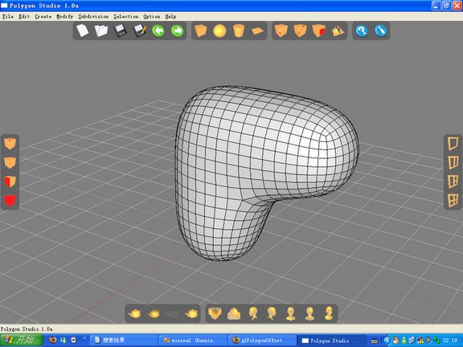
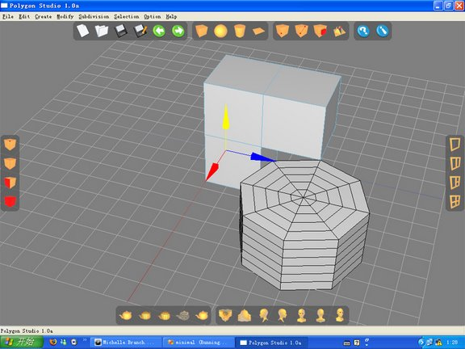
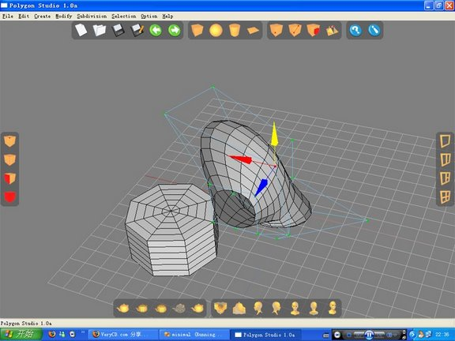
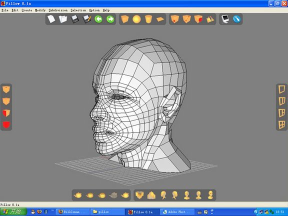
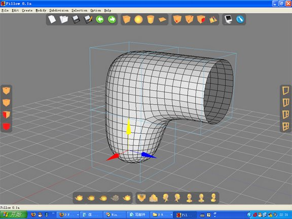
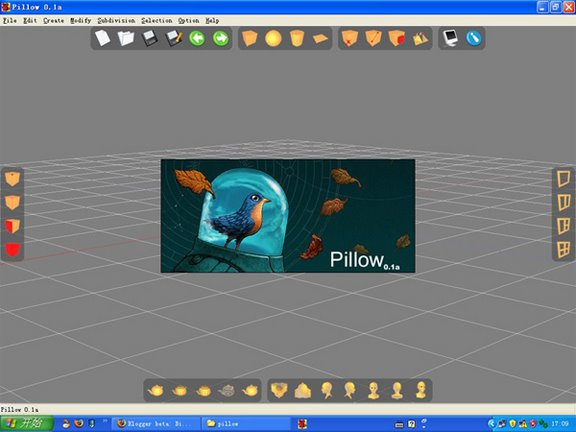

# Pillow
a 3d modeler

Pillow is a light-weight 3D modeler that tries to mimic what Silo is. http://www.nevercenter.com/silo/

In 2003, there was this SARS epidemic outbreak in Beijing. Schools were shut down and we had a really long summer. I got bored and decided to learn 3D Studio Max myself. And then for the following few years, all I wanted to do was computer graphics.

Pillow was a program I wrote during 2006. A project I was really proud of. I didn't know about half-edge or winged-edge at the time, so I made up my own datastructure. The UI was based on WxWidget. I tried to update it during graduate school with Qt and a more mature datastructure, but I couldn't finish. Today, I found the old source code from a dusty harddrive and I decided to uploaded it here and if I have time, I will modernize it with Qt and OpenSubdiv.

I was asked why call it Pillow. Well, I didn't have a good name for it. Initially it was named Cedar for some reason I can't remember. But while working on it, I always used a cube shape to test subdivision. After applying subdivision several times, the shape looks like a pillow, thus I got this name.

Here are some of the old screenshots:

